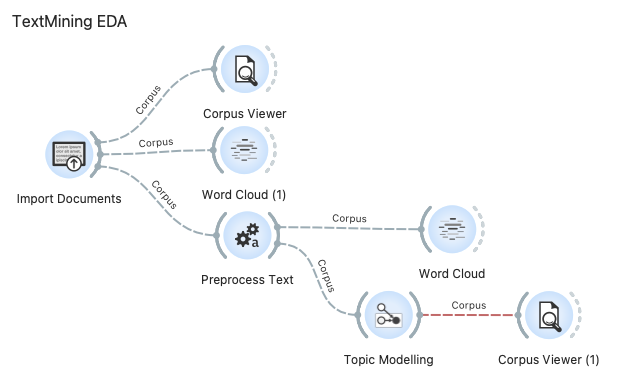

# 오렌지3 - 데이터 마이닝
## 파일 설명
### textmining_tutrial.ows
- 대학원 3학기 오렌지 수업 텍스트 마이닝 실습파일
- 워크를로 저장으로 데이터만 변경하면 활용가능
### textmining_JFK.ows
- 케네디 연설문 분석한 워크플로
- EDA 워크플로
	
- Model 워크플로
	

### textmining_report.ows
- 대학원 과제 워크플로우
- 오렌지 자체 코퍼스를 이용하여 모델 훈련후 테스트파일 분류하기 

- EDA 워크플로

- Model 워크플로

