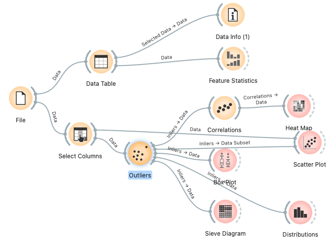
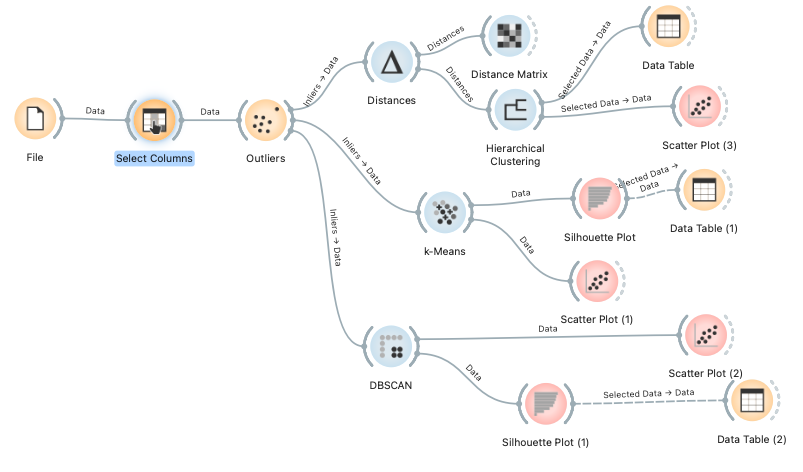

# 와인데이터 이용한 클러스터링 과제 파일
## 파일 설명
### clustring_tutrial.ows
- 군집화 수업 실습파일
### clustring_eda.ows
- 데이터 탐색적 데이터 분석 워크플로 파일
- 워크플로

### clustring_wine_~.ows
- 캐글의 와인데이터 이용
- 피처를 분석하여 데이터를 3가지로 클러스터링
- 워크플로
